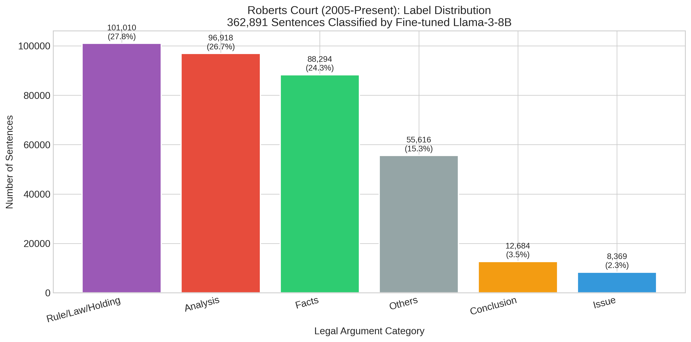
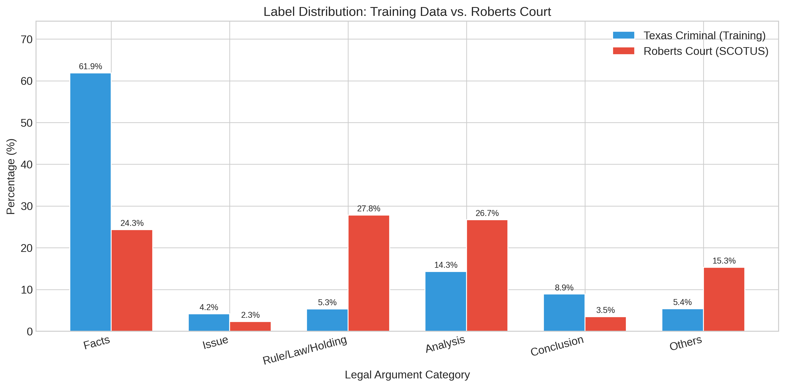
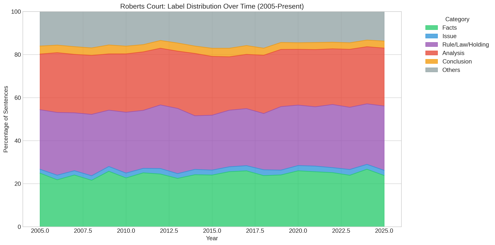

# LAMUS: Legal Argument Mining from U.S. Caselaw using LLMs

[]()
[]()
[]()

## Project Overview

This research project evaluates Large Language Models (LLMs) for legal text classification, specifically classifying legal sentences into rhetorical role categories. The project achieves **85.16% accuracy** using fine-tuned Llama-3-8B and labels **362,891 sentences** from the Roberts Court (2005-2025).

**Institution:** University of North Texas  
**Date:** January 2026

---

## Key Results

### Model Performance

| Rank | Approach | Model | Accuracy |
|------|----------|-------|----------|
| 1 | **Fine-tuned** | Llama-3-8B | **85.16%** |
| 2 | Fine-tuned | LegalBERT | 81.30% |
| 3 | Fine-tuned | Llama-3-8B (original) | 80.37% |
| 4 | Chain-of-Thought | Llama-3-8B | 75.89% |
| 5 | Chain-of-Thought | SaulLM-54B | 72.80% |
| - | **Baseline** | Majority Class | 61.98% |

### Roberts Court Labeled Dataset

| Metric | Value |
|--------|-------|
| Total Sentences | **362,891** |
| Unique Cases | 1,522 |
| Year Range | 2005 - 2025 |
| Categories | 6 |

### Label Distribution (Roberts Court)

| Category | Count | Percentage |
|----------|------:|----------:|
| Rule/Law/Holding | 101,010 | 27.8% |
| Analysis | 96,918 | 26.7% |
| Facts | 88,294 | 24.3% |
| Others | 55,616 | 15.3% |
| Conclusion | 12,684 | 3.5% |
| Issue | 8,369 | 2.3% |

---

## Key Findings

### 1. Significant Domain Shift
Texas criminal cases are **Facts-dominated (62%)**, while SCOTUS opinions are **Rule/Law/Holding-dominated (28%)**. This demonstrates that legal argument structure varies significantly by court level.

### 2. Fine-tuning >> Prompting
Fine-tuning with label masking improves accuracy by **+9.27%** over the best prompting approach (CoT).

### 3. General > Legal Domain Models
Surprisingly, Llama-3-8B (general) outperforms SaulLM-54B (legal) due to better instruction-following from RLHF training.

### 4. Few-Shot Hurts Performance
Few-shot prompting **decreases** accuracy by 19-30% across models - a critical negative result.

### 5. Learning Rate is Critical
Hyperparameter sensitivity: Learning rate causes **10% accuracy swing** (1e-5: 75% → 2e-4: 85%).

---

## Dataset

### Training Data (Texas Criminal Cases)
- **Source:** Texas Criminal Case Law
- **Training:** 2,585 samples
- **Test:** 647 samples
- **Categories:** Facts, Issue, Rule/Law/Holding, Analysis, Conclusion, Others

### Roberts Court Data (SCOTUS)
- **Source:** Supreme Court of the United States
- **Period:** Roberts Court (2005-2025)
- **Sentences:** 362,891
- **Cases:** 1,522

---

## Experiments Conducted

### Prompting Experiments (18)
- **Models:** Llama-3-8B, SaulLM-54B, SaulLM-7B, law-LLM, Qwen3-Thinking, Gemini-2.5-Flash
- **Strategies:** Zero-Shot, Few-Shot, Chain-of-Thought

### Fine-Tuning Experiments (3)
- Llama-3-8B with QLoRA + Label Masking
- LegalBERT full fine-tuning
- Llama-3-8B original (without label masking)

### Ablation Study (9)
- Learning Rate: 1e-5, 5e-5, 1e-4, 2e-4
- Epochs: 1, 2, 3, 5
- LoRA Rank: 8, 16, 32

**Total: 30 experiments**

---

## Repository Structure

```
LAMUS/
├── README.md
├── requirements.txt
├── .gitignore
│
├── code/experiments/
│   ├── A_run_4_models_1st.py              # Main prompting experiments
│   ├── A_run_gemini_experiments_1st.py    # Gemini API experiments
│   ├── B_run_saulm54b_all_prompts.py      # SaulLM-54B experiments
│   ├── B_finetune_with_legalbench.py      # Llama fine-tuning
│   ├── C_fintune_legalBERT.py             # LegalBERT fine-tuning
│   ├── C_finetuning_ablation_v2.py        # Ablation study
│   ├── C_analyze_all_Results.py           # Comprehensive analysis
│   ├── D_train_best_model_no_trl.py       # Best model training (85.16%)
│   ├── D_label_roberts_court_sharded.py   # 4-GPU parallel labeling
│   ├── D_merge_shards.py                  # Merge labeled shards
│   └── D_analyze_roberts_labeled.py       # Roberts Court analysis
│
├── prompts/
│   ├── Zero Shot Prompt.txt
│   ├── Few Shot Prompt.txt
│   └── CoT Shot Prompt.txt
│
├── data/
│   ├── train_final.csv                    # Training data (2,585)
│   └── test_final.csv                     # Test data (647)
│
├── results/
│   ├── experiment_results_20251208_122200.json
│   ├── saulm54b_all_results.json
│   ├── gemini_results_20251208_132625.json
│   ├── finetune_results.json
│   ├── legalbert_results.json
│   └── ablation_results/
│
├── scotus_labeled/
│   ├── roberts_court_labeled_FINAL.csv    # 362,891 labeled sentences
│   └── analysis/
│       ├── label_distribution.png
│       ├── temporal_distribution.png
│       ├── training_vs_scotus.png
│       └── roberts_table.tex
│
└── docs/
    └── LAMUS_Comprehensive_Report.pdf
```


## Hardware Requirements

- **GPU:** NVIDIA Tesla V100 32GB (or similar)
- **RAM:** 64GB+ recommended
- **Storage:** 100GB+ for models and data
- **Multi-GPU:** 4x GPUs for parallel labeling (optional)

---

## Dependencies

```
torch>=2.1.0
transformers>=4.39.0
peft>=0.10.0
bitsandbytes>=0.43.0
accelerate>=0.28.0
datasets>=2.14.0
pandas>=2.0.0
scikit-learn>=1.3.0
matplotlib>=3.7.0
seaborn>=0.12.0
tqdm>=4.65.0
```

---

## Visualizations

### Label Distribution (Roberts Court)


### Domain Shift: Texas vs SCOTUS


### Temporal Distribution (2005-2025)


---

## Citation

```bibtex
@article{lamus2026,
  title={LAMUS: Legal Argument Mining from U.S. Caselaw using Large Language Models},
  author={Lavanya, Radha and Chen, Haihua and Wang, Serene},
  journal={[Conference/Journal Name]},
  year={2026},
  institution={University of North Texas}
}
```

---

## License

This project is for academic research purposes.

---

## Acknowledgments

- University of North Texas for computing resources (DGX Station)
- Hugging Face for model access
- Supreme Court of the United States for public case data
